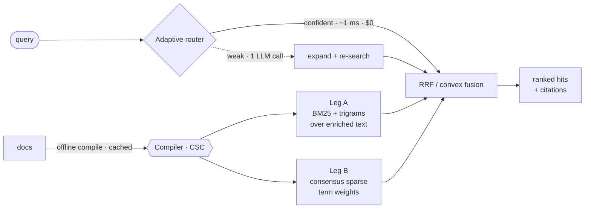

<div align="center">


<br/>


**Compile once. Search forever.**

An LLM reads your documents a single time and compiles them into a plain lexical index. Every query after that is pure BM25: one millisecond, zero cost, fully local. No embedding model. No vector database. No GPU.

[Performance](#performance) · [Quickstart](#quickstart) · [How to use](#how-to-use) · [Evaluation](#evaluation) · [Cost](#cost) · [How it works](#how-it-works)

</div>

---

## Performance

No embeddings. No GPU. On BEIR scifact, it still matches a four-billion-parameter embedder.

<div align="center">

</div>

`Nrag doc2query×2` scores **0.7291 nDCG@10** and **0.7042 MRR**, with no embeddings, no GPU, and no vector database. It ties `qwen3-embedding-4b` and wins on MRR. It clears `text-embedding-3-small` and `bge-m3` outright. Every score here costs **`$0` per query**. Only the 8B embedder finishes ahead. All 30 rows and the ablations live in [`benchmarks/scifact_results.md`](benchmarks/scifact_results.md).

### Where embeddings break

Reasoning-heavy retrieval does not reward similarity. The top model on MTEB scores 59. On **BRIGHT**, it scores **18.3**. This is the ground Compiled Retrieval is built for.

| nDCG@10 (avg) | BM25 zero-shot | **off-the-shelf dense** | BM25 + GPT-4 CoT | LATTICE (emb-free SOTA) |
|---|:--:|:--:|:--:|:--:|
| | 14.3 | **18.3** ⬇ | 27.0 | 46.7 |

The target is plain. Beat off-the-shelf dense at **`$0` per query**, and close on reasoning systems while holding one millisecond.

---

## Quickstart

```bash
pip install nrag
```

```python
from nrag import Nrag

rag = Nrag(preset="fast")                      # pure lexical, no LLM, no setup, no models
rag.add_texts(["Dijkstra finds shortest paths.", "Tomato soup needs basil."])
print(rag.search("shortest path", k=1)[0].text)
# -> Dijkstra finds shortest paths.
```

Nothing to download. No Java, no GPU, no database. An LLM is optional. Plug one in when you want compiled enrichment and grounded answers. Everything works without one.

---

## How to use

### 1 · Pure lexical (no LLM)

```python
from nrag import Nrag, Document

rag = Nrag(preset="fast", path="./idx")             # on-disk; omit path for in-memory
rag.add("docs/")                                    # a dir, file, glob, texts, or Documents
rag.add("report.pdf")                               # needs nrag[pdf]
rag.add_texts(["first passage", "second passage"])
rag.add([Document(doc_id="d1", text="...", source="d1.md", metadata={"team": "billing"})])

for h in rag.search("how do refunds work?", k=5):
    print(f"{h.score:.3f}  {h.source}\n   {h.text[:100]}")
rag.close()
```

### 2 · Plug in any LLM

One method: `complete`. Bring the built-in OpenAI-compatible adapter, wrap a function, or bring nothing.

```python
from nrag.llm import OpenAICompatLLM, CallableLLM

# Any OpenAI-compatible endpoint: OpenAI, Ollama, vLLM, llama.cpp, LM Studio, Together, Groq...
llm = OpenAICompatLLM(base_url="http://localhost:11434/v1/", model="llama3.2", api_key="ollama")

# ...or wrap any callable (called with just the prompt string by default)
llm = CallableLLM(lambda prompt: my_model(prompt))

# ...or no LLM at all; pure lexical retrieval still works
```

### 3 · Presets

| Preset | LLM | What runs | For |
|---|:--:|---|---|
| `fast` | no | pure lexical (BM25 + trigrams + title) | sub-10 ms retrieval, no LLM |
| `quality` *(default)* | ✔ | + contextual indexing (offline) + query expansion + grounded answers | best general RAG |
| `compiled` | ✔ | + the index-time **compiler** (CSC) + the adaptive **router** | reasoning corpora, `$0` queries |

Override any field: `Nrag(preset="compiled", consensus_k=5, engine="sqlite")`.

### 4 · Compiled Retrieval

> **Retrieval intelligence is a compile-time problem, not a serve-time problem.**

One offline pass per chunk, cached forever. It writes plain text into the search index, never into the text you cite:

| Pillar | What the compiler adds | Prior art |
|---|---|---|
| **blurb** | a chunk-specific context sentence | Anthropic Contextual Retrieval, 2024 |
| **questions** | the queries this chunk answers | doc2query / docTTTTTquery |
| **propositions** | atomic, decontextualized facts | Dense X, EMNLP 2024 |
| **reasoning** | multi-hop bridges *not lexically present* | the BRIGHT-winning signal, precomputed |

**Consensus Sparse Compilation (CSC).** Sample the compiler `k` times. A term's weight is how often it agrees with itself. Terms that recur are real, so they get promoted. Terms that appear once are hallucinations, so they get dropped. No training, no labels. Literal terms like IDs and error codes keep a floor weight, so exact match never breaks.

```python
llm = OpenAICompatLLM(base_url="...", model="...", api_key="...")

rag = Nrag(llm=llm, preset="compiled", path="./idx")
rag.compile("docs/")                                # offline, cached by content-hash
print(rag.query("does this scale to a billion rows?").answer)

rag = Nrag.open("./idx")                             # reopen with NO llm, it still serves
```

**The router.** The only LLM call at query time, and it rarely fires. The first pass is one millisecond and free. Only when confidence runs low does Nrag spend a call to expand and re-search. Short, precise queries are left untouched, which sidesteps the expansion trap that hurts strong retrievers.

```python
rag.search("how can I get my money back?", k=5)
print(rag.last_route)   # RouterDecision(escalate=..., reason='no_hits'|'low_margin'|'confident', ...)
```

### 5 · Persistent, incremental, portable

```python
rag = Nrag.open("./idx", llm=llm)
rag.sync("docs/")                     # re-index only changed files; drop deleted ones
rag.remove("d1")                      # delete one document
```

**Compile once, serve anywhere.** The index is a plain lexical artifact. Bundle it, ship it to an air-gapped machine, serve it with no model and no network:

```bash
nrag export --index ./idx --out ship.nrag.tgz      # portable bundle (drops the LLM cache)
nrag import ship.nrag.tgz --index ./served         # unpack on the target machine
nrag query  "how do refunds work?" --index ./served   # $0, ~1 ms, no model, no network
```

**Or host the compiler.** Clients send documents and get back a ready-to-serve bundle. The embedding model never exists, so it never leaves your walls.

```bash
nrag serve --base-url http://localhost:11434/v1/ --model llama3.2   # POST /compile, GET /bundle/<job>
```

### 6 · Answers, citations, streaming

```python
res = rag.query("How do refunds work?", k=8)
print(res.answer)                        # grounded answer (None if no LLM)
for c in res.citations:
    print(c.marker, c.source, f"{c.score:.3f}")
for tok in rag.query_stream("How do refunds work?"):
    print(tok, end="")
```

### 7 · Drop into LangChain / LlamaIndex

```python
from nrag.integrations import to_langchain_retriever, to_llamaindex_retriever
lc = to_langchain_retriever(rag, k=5)      # a LangChain BaseRetriever
li = to_llamaindex_retriever(rag, k=5)     # a LlamaIndex BaseRetriever
```

### 8 · Command line

```bash
nrag compile ./docs --index ./idx --base-url http://localhost:11434/v1/ --model llama3.2
nrag query  "how do refunds work?" --index ./idx
nrag stats  --index ./idx
nrag tco    --queries-per-month 5000000 --months 36    # cost model (below)
```

---

## Evaluation

Nrag measures itself honestly. Every benchmark is labelled by cost per query, so a free lexical system is never quietly scored against one that runs a model on every search.

### The metrics module (pure-Python, no deps)

`nrag.eval.ir_metrics` implements the standard IR metrics with zero dependencies: `ndcg@k`, `recall@k`, `precision@k`, `hit@k`, `mrr`, `map`.

```python
from nrag.eval import evaluate_run

qrels = {"q1": {"docA": 1, "docC": 1}}                    # ground-truth relevance
run   = {"q1": {"docA": 9.1, "docB": 4.2, "docC": 2.0}}  # your system's doc -> score
print(evaluate_run(qrels, run, metrics=("ndcg@10", "recall@10", "mrr")))
# {'ndcg@10': 0.92, 'recall@10': 1.0, 'mrr': 1.0}
```

Score Nrag on your own labelled queries:

```python
rag = Nrag(preset="fast"); rag.add("corpus/")
run = {}
for qid, text in my_queries.items():
    scores = {}
    for h in rag.search(text, k=100):
        did = h.chunk_id.split("::", 1)[0]                 # chunk -> parent doc
        scores[did] = max(scores.get(did, -1e9), h.score)  # max-pool chunks
    run[qid] = scores
print(evaluate_run(my_qrels, run, ("ndcg@10", "recall@100", "mrr")))
```

### BEIR & BRIGHT runners

Install the extra (`pip install "nrag[eval]"`), then build a fresh index and score it:

```python
from nrag.eval import run_beir, run_bright, run_bright_all

# BEIR: breadth / parity, scored against the published BM25 anchor
print(run_beir(lambda: Nrag(preset="fast"), dataset="scifact", split="test"))

# BRIGHT: the reasoning-intensive hero benchmark (needs an LLM for the compiled preset)
print(run_bright(lambda: Nrag(llm=llm, preset="compiled"), subset="biology"))
results = run_bright_all(lambda: Nrag(llm=llm, preset="compiled"))   # all 12 subsets
```

**Two things the benchmarks proved.**

- **Expanding the query hurts.** LLM query2doc costs 0.015 nDCG. Classic RM3 costs up to 0.19. So Nrag enriches the document, never the query, and the router only expands when a search comes back weak.
- **Enriching the document wins.** Let the LLM write, at index time, the questions each passage answers. Queries stay pure BM25. It is the best embedding-free result on the board, and it is free at query time.

### Live compiled-retrieval benchmark

```bash
python benchmarks/csc_eval.py baseline                      # pure-lexical, free
OPENROUTER_API_KEY=... python benchmarks/csc_eval.py smoke   # compile a few docs; print bundle + weights
OPENROUTER_API_KEY=... python benchmarks/csc_eval.py compiled --index ./idx_csc --k 3
```

### Reproducing

```bash
pip install "nrag[eval]"
export NRAG_LLM_BASE_URL=... NRAG_LLM_MODEL=... NRAG_LLM_API_KEY=...   # any OpenAI-compatible endpoint
python -m pytest                                                        # 87 passing, 3 opt-in skipped
```

---

## Cost

Quality is half the story. The other half is the bill. Nrag pays for intelligence once, at compile time. An embedding stack pays on every query, forever, plus the RAM to keep its vectors resident.

<div align="center">

</div>

```bash
nrag tco --docs 1000000 --queries-per-month 5000000 --months 36
```
```python
from nrag.tco import TCOInputs, compute_tco, format_report
print(format_report(TCOInputs(), compute_tco(TCOInputs())))
```

Every rate is yours to change. Put in your own numbers and read your own break-even.

---

## How it works



- **Structure-aware chunking** with span-exact offsets. The enriched `indexed_text` you search stays separate from the `raw_text` you cite.
- **Two sparse legs**, fused by RRF or a convex combination. Hybrid's complementarity, with no dense leg.
- **An offline compiler** with a content-hash cache, so re-indexing is free, and a cost guard.
- **An adaptive router** that spends an LLM call only when the cheap path is unsure.

---

## Engines

Swap the search backend. Nothing else changes.

| Engine | Install | Notes |
|---|---|---|
| `tantivy` *(default)* | core | fast, persistent, multi-field scoring |
| `sqlite` | core | FTS5, zero extra deps, portable single file |
| `bm25s` | `nrag[bm25s]` | in-memory, pure-NumPy, fast batch |

```python
rag = Nrag(preset="fast", engine="sqlite", path="./idx")
```

## Install extras

```bash
pip install nrag                # core: tantivy + stemmer + http client. No models, ever.
pip install "nrag[openai]"      # openai SDK + tiktoken (exact token counts)
pip install "nrag[bm25s]"       # in-memory bm25s engine
pip install "nrag[pdf,html]"    # PDF text + fast HTML loaders
pip install "nrag[eval]"        # ranx / pytrec_eval / BEIR / RAGAS / datasets
```

## Design guarantees

- **Works with no LLM.** Pure lexical retrieval always runs. LLM features switch off by construction when no model is supplied.
- **All model cost is offline.** Enrichment happens once at index time and is cached. The only query-time call is the gated router.
- **Portable and explainable.** Scores are deterministic. The serving index is a plain directory you can archive and ship.

## License

MIT.
